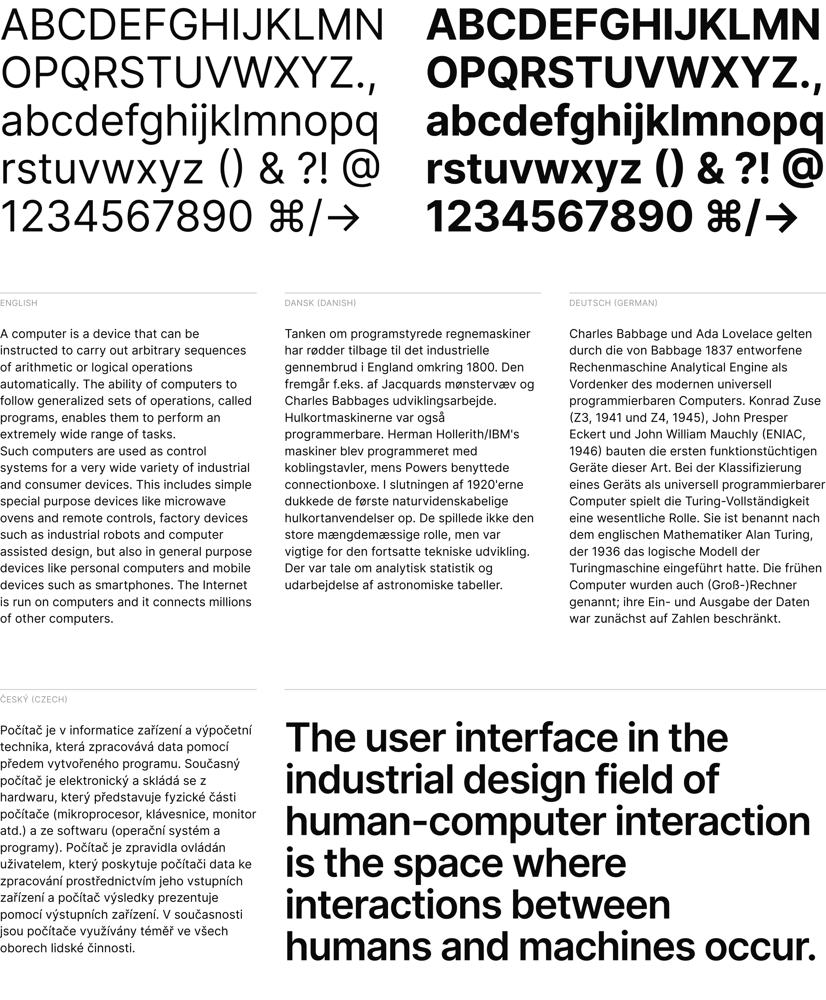

# Inter Derp

**Inter Derp** is a work-in-progress fork of the [Inter](https://github.com/rsms/inter) typeface which has been carefully crafted & designed for computer screens; then modified according to my tastes.
Inter Derp features a tall x-height to aid in readability of mixed-case and lower-case text.
Inter Derp is a [variable font](https://rsms.me/inter/#variable) with
several [OpenType features](https://rsms.me/inter/#features), like contextual alternates that adjusts punctuation depending on the shape of surrounding glyphs, slashed zero for when you need to disambiguate "0" from "o", tabular numbers. It is non-opinionated and does not force you to use a specific look and feel of text, allowing it to be a much more versatile, flexible font.

[**Download Inter Derp font files…**](https://github.com/hydino2085143/inter-derp/releases/latest)

<br>

[](https://rsms.me/inter/samples/)

### Changes
Inter Derp has changes which fit my own vision of Inter, and reverts some changes to Inter which I do not agree with. The list of planned changes is as follows:
- [ ] Alternate /t without a curved hook end
- [ ] Alternate /y without a curved hook end
- [ ] Alternate /j without a curved hook end
- [ ] Restores the old oblique-style italic glyphs to the Italic family as a stylistic set. (As of 4.0-beta 5, this applies only to /a, /e, and /f.)
- [ ] "Book" stylistic set which removes curved tails
- [ ] Inter Text Roman's /a has a straight terminal (Might expand to other characters as I see fit)
- [ ] Shape of /a changed slightly to have a straight junction, rather than the current curved look.
- [ ] Widening of Inter Light fonts slightly

This list of changes is only a roadmap, it will be ticked off as and when I finish each item.

*All diacritic/compound glyphs will also be changed with these.

### Quick questions

- **Where can I get Inter Derp?** [Here](https://github.com/hydino2085143/inter-derp/releases/latest)
- **I think I found a bug. How can I let you know?** Inter Derp is a forked version of Inter. If your issue pertains to the main font itself, [open an issue on the original font here.](https://github.com/rsms/inter/issues/new?template=bug_report.md) Unless your issue is related to any changes which I have explicitly outlined [here](https://github.com/hydino2085143/inter-derp#changes).
- **I have a question. Where can I get help?** [Post in Discussions Q&A](https://github.com/hydino2085143/inter-derp/discussions/categories/q-a)
- **Why should I use Inter Derp?** Inter Derp offers alternate character styles for the `t` and `y` characters which are more "casual" in nature, making it a good fit for casual designs such as website headers or children's books. If you however need a completely stable, professional font, I recommend that you use the official Inter font.
- **Can I legally use Inter Derp for my purpose?** Most likely _yes!_ Inter Der[] is free and open source.
  ([Read the license](LICENSE.txt) for details.)
- **Why did you make a derivative version of Inter?** I wanted to make a version of the Inter font for my own uses and tastes, unencumbered by the more practical concerns and needs of the Inter project. 

## Using & installing Inter Derp

- [**Download the latest font files…**](https://github.com/hydino2085143/inter-derp/releases/latest)
- No CDN is currently offered for webfont files of Inter Derp. You will have to self-host.

```css
:root { font-family: 'Inter Derp', sans-serif; }
@supports (font-variation-settings: normal) {
  :root { font-family: 'Inter Derp var', sans-serif; }
}
```

### Friends of Inter Derp
- [Official Inter Typeface](https://github.com/rsms/inter)
- [Inter with Shavian character support](https://github.com/Shavian-info/interalia)


## Notable projects using Inter Derp
- None so far.


> **Have you made something nice with Inter Derp?**<br>
> [Please share in Show & Tell! →](https://github.com/hydino2085143/inter-derp/discussions/categories/show-and-tell)


## Supporters & contributors

A wholehearted **Thank You** to everyone who supports the Inter project!

Special thanks to
[@rsms](https://github.com/rsms), for creating and maintaining the original Inter font.
[@thundernixon](https://github.com/thundernixon) and
[@KatjaSchimmel](https://github.com/KatjaSchimmel)
who have put in significant effort into making Inter what it is through
their contributions ♡

See [graphs/contributors](https://github.com/hydino2085143/inter-derp/graphs/contributors)
for a complete list of all contributors.


## Contributing to this project

For instructions on how to work with the source files and how to
[compile & build font files](CONTRIBUTING.md#compiling-font-files),
refer to [**CONTRIBUTING.md**](CONTRIBUTING.md).

Inter is licensed under the [SIL Open Font License](LICENSE.txt)


## Design

_This section discusses some of the design choices made for Inter._

Inter can be classified as a geometric neo-grotesque, similar in style to Roboto, Apple San Francisco, Akkurat, Asap, Lucida Grande and more. Some trade-offs were made in order to make this typeface work really well at small sizes:

- Early versions of Inter was not suitable for very large sizes because of some small-scale glyph optimizations (like "pits" and "traps") that help rasterization at small sizes but stand out and interfere at large sizes. However today Inter works well at large sizes and a [Display subfamily](https://github.com/rsms/inter/releases/tag/display-beta-1) is in the works for really large "display" sizes.

- Rasterized at sizes below 12px, some stems—like the horizontal center of "E", "F", or vertical center of "m"—are drawn with two semi-opaque pixels instead of one solid. This is because we "prioritize" (optimize for) higher-density rasterizations. If we move these stems to an off-center position—so that they can be drawn sharply at e.g. 11px—text will be less legible at higher resolutions.

Inter is a [variable font](https://rsms.me/inter/#variable) and is in addition also distributed as a set of traditional distinct font files in the following styles:

| Roman (upright) name | Italic name          | Weight
| -------------------- | -------------------- | ------------
| Thin                 | Thin Italic          | 100
| Extra Light          | Extra Light Italic   | 200
| Light                | Light Italic         | 300
| Regular              | Italic               | 400
| Medium               | Medium Italic        | 500
| Semi Bold            | Semi Bold Italic     | 600
| Bold                 | Bold Italic          | 700
| Extra Bold           | Extra Bold Italic    | 800
| Black                | Black Italic         | 900
